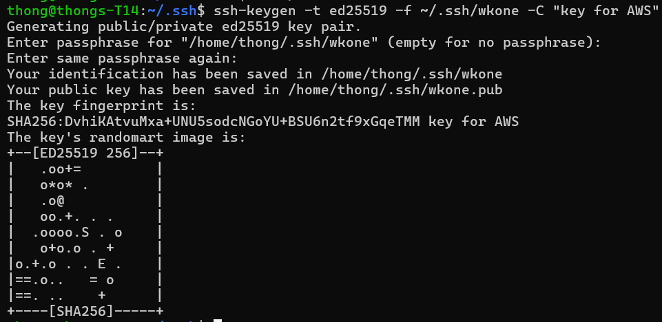

# acit4640-wk2-lab

### Part 1

- command to create a ssh key pair
<!-- insert the command -->
```bash
ssh-keygen -t ed25519 -f 2048 -f ~/.ssh/wkone -C "key for AWS"
```

<!-- insert the image -->


### Part 3
#### Script 0 - env file
```bash
#!/bin/bash 
export USER="admin"
export IPADDR="ec2-98-94-93-234.compute-1.amazonaws.com"
export SSHKEY="~/.ssh/wkone"
```

#### Script 1 - nginx-install
```bash#!/bin/bash
# SSH into our EC2 instance using the environment variables sourced from "env" file
# Using heredoc syntax to send apt commands to install and start nginx
ssh -i $SSHKEY -T $USER@$IPADDR << EOF
sudo apt update
sudo apt install -y nginx
sudo systemctl enable --now nginx
EOF
```

#### Script 2 - document-write
```bash#!/bin/bash
# SSH into our EC2 instance using the environment variables sourced from "env" file
# Using heredoc syntax to send multiple lines to the SSH connection
ssh -i $SSHKEY -T $USER@$IPADDR << EOF

# sudo tee is used here instead of something like cat to overwrite the default nginx html file along with another heredoc so we can send multiple lines of HTML code.
sudo tee /var/www/html/index.nginx-debian.html << EOD
<!DOCTYPE html>
<html lang='en'>
<head>
  <meta charset='UTF-8'>
  <meta name='viewport' content='width=device-width, initial-scale=1.0'>
  <title>Hello World</title>
</head>
<body>
  <h1>Hello World!</h1>
  <p>Today's date is: $(date +'%A/%B/%Y') </p>
</body>
</html>
EOD

# reload the nginx service using systemctl
sudo systemctl reload nginx
EOF
```